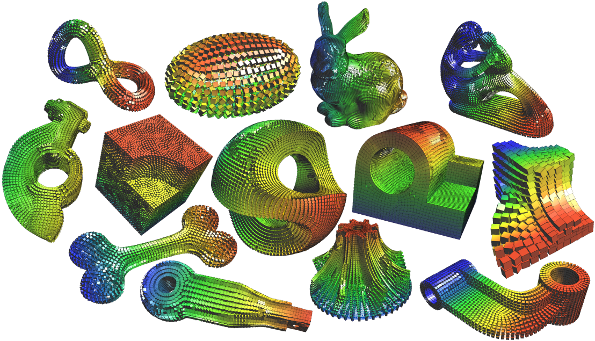

# SH-cross-frame



This repo is a refactoring of the unofficial source code for the paper "[Boundary aligned smooth 3D cross-frame field](https://doi.org/10.1145/2070781.2024177)" as implemented by [Kenshi Takayama](https://kenshi84.github.io) [[code]](http://dl.acm.org/citation.cfm?id=2024177), with the goal of making it easier to configure and use. 

If you have any questions about the implementation, you can refer to the official [[code]](http://www.cad.zju.edu.cn/home/hj/11/SH-cross-frame-1607-JiongCHEN.7z) (written in Fortran and Maxima) provided by the author, [Jin Huang](http://www.cad.zju.edu.cn/home/hj/index.xml).

If you use this code, you may need to cite the paper:

```
@article{10.1145/2070781.2024177,
    author = {Huang, Jin and Tong, Yiying and Wei, Hongyu and Bao, Hujun},
    title = {Boundary aligned smooth 3D cross-frame field},
    year = {2011},
    issue_date = {December 2011},
    publisher = {Association for Computing Machinery},
    address = {New York, NY, USA},
    volume = {30},
    number = {6},
    issn = {0730-0301},
    url = {https://doi.org/10.1145/2070781.2024177},
    doi = {10.1145/2070781.2024177},
    journal = {ACM Trans. Graph.},
    month = dec,
    pages = {1–8},
    numpages = {8},
    keywords = {N-RoSy frame field, hexahedral, spherical harmonics}
}
```

# :bulb: What did I do?

- [x] Refactor CMake configuration.
- [x] Add command line application.
- [ ] Make `FRAME3D_FIXED_BOUNDARY` macro optional.
- [ ] Make deps lighter.

# :link: Requirements / dependencies

- [ALGLIB](https://www.alglib.net) (already included)
- [CLI11](https://github.com/CLIUtils/CLI11?tab=readme-ov-file#install) (already included)
- [CoMISo](https://www.graphics.rwth-aachen.de/software/comiso/) (already included)
- [Geogram](https://github.com/BrunoLevy/geogram/wiki)
- [libigl](https://libigl.github.io) (already included)
- [OpenVolumeMesh](https://www.graphics.rwth-aachen.de/software/openvolumemesh/) (already included)
- [spdlog](https://github.com/gabime/spdlog) (already included)
- [tetgen](https://www.wias-berlin.de/software/tetgen/1.5/index.html) (already included)

# :checkered_flag: Getting started

```
git clone https://github.com/Canjia-Huang/SH-cross-frame.git
```

# :hammer: Build

```
mkdir build
cd build
cmake ..
make
```

# :computer: Usage

After successful compilation, the executable `SHCrossFrame_CLI` will be in the `build/bin` directory. To use it:

```
./SHCrossFrame_CLI [OPTIONS]


OPTIONS:
  -h,     --help              Print this help message and exit 
  -i TEXT:FILE REQUIRED       input triangle/tetrahedral mesh path (if the input is a triangle 
                              mesh, will be tetrahedralization by tetgen, and save to 
                              `output_path`+`_tet.mesh`) 
  -o TEXT                     output per vertex frame field file (.fra) path 
  -w FLOAT                    boundary weight (default: 200) 
  -v                          output visualization file (.geogram)
```

After a successful run, a `.fra` frame field file will be generated. The format is as follows: 

```
FRA 1
nb_vertices 3 4
vertex0-vector0.x vertex0-vector0.y vertex0-vector0.z
vertex0-vector1.x vertex0-vector1.y vertex0-vector1.z
vertex0-vector2.x vertex0-vector2.y vertex0-vector2.z
vertex1-vector0.x vertex1-vector0.y vertex1-vector0.z
...
```

Under the "-v" option, a `.geogram` visualization file will also be created, which can be opened with [Vorpaview](https://github.com/BrunoLevy/geogram/wiki/Vorpaview) (the visualization software from the Geogram library).

## Example

```
./SHCrossFrame_CLI -i ../../data/sculpture.obj -v
```